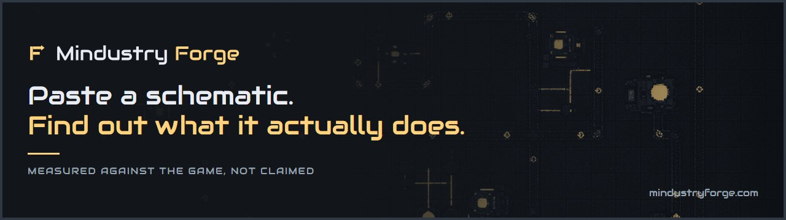
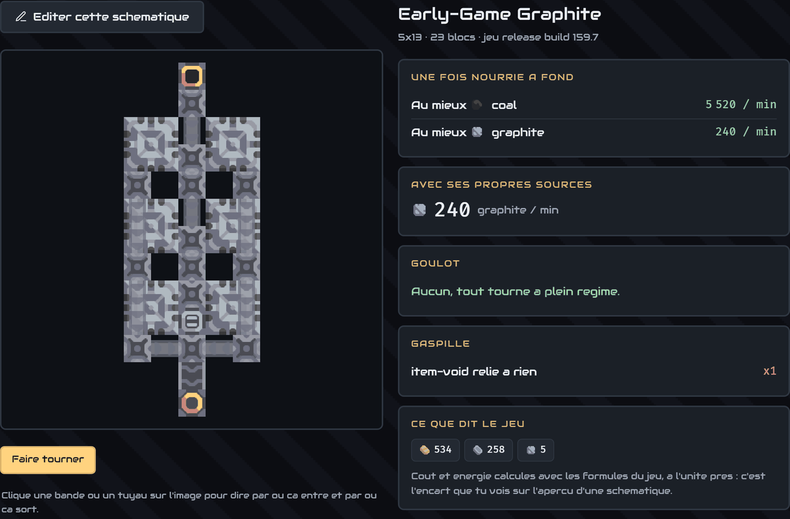
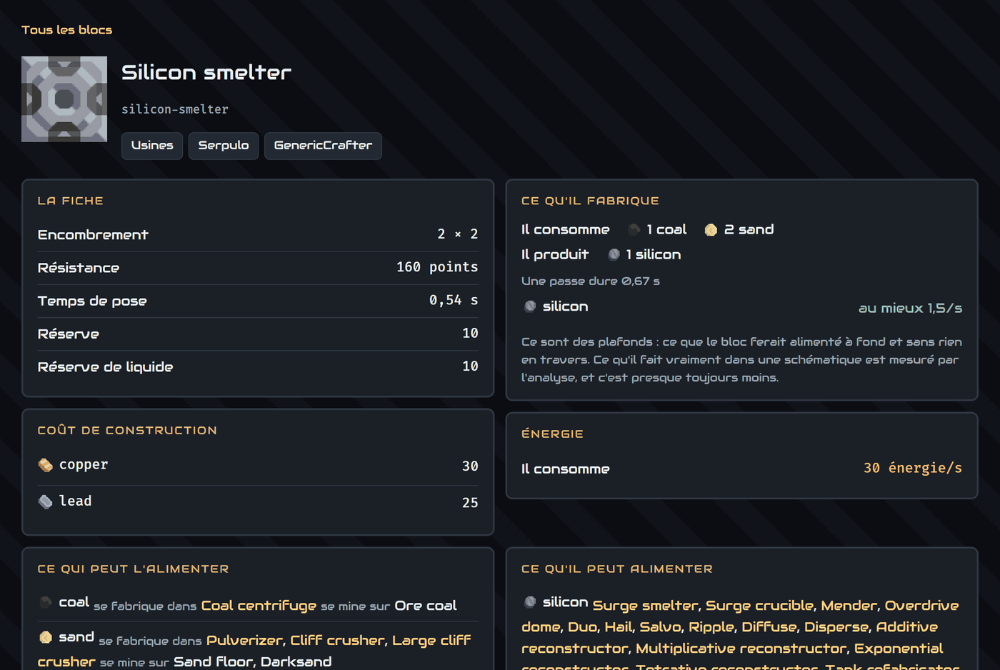

**English** | [Français](README.fr.md)

<p align="center">
  
</p>

# Mindustry Forge

<p align="center">
  <a href="https://github.com/yamakajump/mindustry-forge/actions/workflows/site.yml"></a>
  <a href="https://github.com/yamakajump/mindustry-forge/actions/workflows/tests.yml"></a>
  <a href="https://github.com/yamakajump/mindustry-forge/actions/workflows/conventions.yml"></a>
  <a href="https://github.com/yamakajump/mindustry-forge/actions/workflows/dependency-audit.yml"></a>
</p>

**Paste a schematic. Find out what it actually does.**

Every Mindustry calculator on the web answers the same question: how many machines for a
clean ratio. That is arithmetic, and four sites already do it. None of them will look at
*your* layout, on *your* ore patch, and tell you it makes 47.3 graphite a minute because
the second press is fed 61% of the time.

This does that, and then tells you where to move the blocks.

Live at **[mindustryforge.com](https://mindustryforge.com)**.

<p align="center">
  
</p>

<p align="center">
  <em>A real schematic from the catalogue, analysed in the browser. It makes 240 graphite a
  minute, and one of its 23 blocks is an item void connected to nothing.</em>
</p>

## Why you can check the numbers instead of trusting them

Every other tool computes its figures by hand and asks you to believe them. This repository
ships a bench that **runs the actual game**: a headless Mindustry server, a pinned world, a
pinned number of seconds, the schematic stamped in, and a count of what comes out.

So the analyser is not the source of truth. It is a fast approximation of one, and the bench
is what holds it to account. A layout whose computed output disagrees with its measured
output is a bug here, not a matter of opinion.

```
npm run oracle          # replays every recorded scenario against its measurement
```

**Largest disagreement: 0.00%, over 164 recorded scenarios** (28 August 2026). Two of them
have never been measured, and say so rather than passing quietly.

**This runs on every push.** The replay needs no server and no game, only the measurements
already recorded, so continuous integration does it in seconds and fails the build past two
percent. It is a gate, not a log line. `node tools/gap.mjs` runs beside it without a gate,
so the figure below lands in the record of every run instead of in somebody's memory.

Nobody else can make that claim, because nobody else has the bench.

## What this repository is honest about

The engine is proven. **The report the player reads is computed by something else**, and the
two do not agree yet. That is written here rather than left for a reader to find.

- `site/public/forge/engine/**` steps the game tick by tick, and throttles a machine by the
  power it actually receives. This is what the bench measures, and what the animated view
  runs.
- `site/public/forge/bilan.js` solves a steady state by maximum flow. Power never enters
  the solve, so the bottleneck it reports is blind to it.

**The one shown to the player is the second. The one proven against the game is the first.**
A layout thirty energy a second short can therefore be told everything runs flat out.

The gap is measured, not estimated:

```
node tools/gap.mjs
```

```
88 scenarios compared, of 164 recorded      (28 August 2026)
  agree within 20%                    49
  the throughput is wrong             27
  right throughput, wrong container   12
```

Moving the report onto the engine changes every number on the site at once, so it is stated
work rather than silent work. [`docs/known-gaps.md`](docs/known-gaps.md) carries it.

## It runs on your machine

The analysis is JavaScript and happens in your browser. Nothing is uploaded, a base you have
not published stays yours, and the page costs the same to host whether ten people or ten
thousand use it.

That settles half a question this repository keeps asking of itself: there is exactly one
implementation of the analysis, in one language. A second one, in another language, for a
command line or a backend, would be a second thing to be wrong.

## Every block, with the game's own figures

<p align="center">
  
</p>

<p align="center">
  <em>Rates on a block page are nominal ceilings, and the page says so. What a block does
  inside a real schematic is measured by the analysis, and it is almost always less.</em>
</p>

## Try it

The analyser is a static page and needs no server of its own:

```bash
cd site/public && python -m http.server 8770
```

Then open <http://127.0.0.1:8770/> and paste a schematic. Any static file server will do.
Opening the HTML straight off the filesystem is the one thing that does not work: a browser
refuses a module import over `file://`.

That gets you the analyser, and the editor with it: the *Build from scratch* button opens
it without leaving the page. What it does not get you is anything with its own address.
`/editer`, `/blocs`, `/comparer` and the tools are routes, not files, and a static server
answers 404 for all of them -- along with accounts, saving and the public catalogue. Those
need the Laravel application below.

## Run the whole site

```bash
cd site
composer install
cp .env.example .env && php artisan key:generate
touch database/database.sqlite          # see below
php artisan migrate
php artisan storage:link
php artisan serve --port=8770
```

The empty database file is not optional and not obvious. `.env.example` selects SQLite, and
`php artisan migrate` on a fresh clone stops on `Database file at path [...] does not
exist`. Laravel offers to create it when you are sitting at a prompt and simply fails when
you are not, which is every script and every CI job. On Windows without a POSIX shell, use
`New-Item database/database.sqlite`.

The whole sequence above was run against a fresh clone on 27 August 2026, and `php artisan
test` passes at the end of it.

Discord sign-in is configured in `.env`:

```
DISCORD_CLIENT_ID=...
DISCORD_CLIENT_SECRET=...
```

Create the application at <https://discord.com/developers/applications>, with
`http://127.0.0.1:8770/auth/discord/callback` as the redirect URI.

On Windows, PHP ships without a certificate store and every outbound HTTPS call fails on
`unable to get local issuer certificate`. The fix is the certificate bundle, not turning
verification off:

```bash
curl -o C:/php/extras/cacert.pem https://curl.se/ca/cacert.pem
```

```ini
; then in php.ini
curl.cainfo = "C:\php\extras\cacert.pem"
openssl.cafile = "C:\php\extras\cacert.pem"
```

## Tests

```bash
npm test                     # the analyser, run exactly as the page runs it
cd site && php artisan test  # the application
python -m pytest tests/ -q   # the file formats. Runs no game, despite sitting by the bench
```

Counts on 28 August 2026: 723, 499 and 16. They will be wrong tomorrow, which is why they
carry a date.

Use `npm test` rather than a glob of your own. `node --test "tests/js/*.test.js"` looks
equivalent and silently skips every subdirectory, which is 304 of the 723.

## What is where

| | |
|---|---|
| `site/public/forge/` | the analysis: reads a `.msch`, builds the flow graph, finds the bottleneck |
| `site/public/forge/engine/` | the tick-by-tick simulation, the half the bench proves |
| `site/public/forge/editor/` | the editor, with the game's own placement mechanics |
| `site/public/index.html` | the page, which holds no calculation of its own |
| `site/app/`, `site/routes/` | what a server is actually for: remembering, and letting people share |
| `bench/` | runs the real game and measures the same schematic |
| `tests/js/` | the analysis, run exactly as the page runs it |
| `tools/` | the oracle, the gap, and the generators for the catalogue and the sprites |
| `docs/` | the roadmap, the gaps we know by name, and the pitfalls already paid for |

## The `.msch` format is not guessed

`site/public/forge/schematic.js` implements the layout of `Schematics.write` and `TypeIO`
from Mindustry v159.7, the version pinned throughout this repository. Reading a format off a
wiki is how a tool comes to disagree with the game about what a player just pasted.

## Contributing

[`CONTRIBUTING.md`](CONTRIBUTING.md) says what this project is strict about, so you can
decide before writing code whether the rules suit you. Conduct is in
[`CODE_OF_CONDUCT.md`](CODE_OF_CONDUCT.md), and vulnerabilities go through GitHub's private
reporting rather than an issue: [`SECURITY.md`](SECURITY.md).

[`docs/roadmap.md`](docs/roadmap.md) is the plan: what exists, what is being built, and in
which order. [`docs/known-gaps.md`](docs/known-gaps.md) names what the engine does not model
and what the bench does not prove, including the one above.

Two rules govern the repository, and both are in `AGENTS.md`:

**One implementation of the analysis.** A second, in another language, would be a second
thing to be wrong.

**Figures are proven against the game, not against us.** If the analysis and the bench
disagree, that is a bug here. Never adjust a constant to make a test pass without checking
what the bench says.

## Licence

AGPL-3.0. The full text is in [`LICENSE`](LICENSE).

The GPL would have been enough for software you install: it triggers on distributing a
binary. Here the product is a web service and nobody distributes anything, so under the GPL
anyone could host a closed, privately improved copy of this engine and never give anything
back. The AGPL adds the one clause that matters to this project: running the code on a
publicly reachable server obliges you to publish the source.

What is shared is the analysis engine and the bench that verifies it. That is the hard part,
and it is the part the Mindustry community has no other copy of.

Schematics are not covered by this licence. They belong to their authors, and the ones
collected elsewhere carry their origin in the database and on their page.
